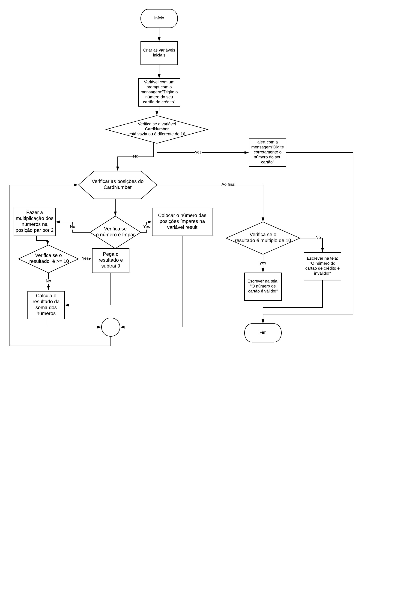

1. Criei uma função IsValidCard e dentro as seguintes variáveis iniciai: result = 0 e multResult que irá pegar o resultado da multiplicação futuramente.
2. Criei uma variável que faz um prompt que pede o número de cartão de crédito.
3. Criar uma variável que transforma o número em um array invertido.
3. Fiz um if que verifica se o número solicitado no prompt foi preenchido ou se o tamanho dele é diferente de 16, se sim aparece um alert solicitando que o usuário digite corretamente o número.
4. Criei um for com posição inicial = 0, para que enquanto ela seja menor que o tamanho da mensagem ela adicione mais 1 para pegar as posições do array de números.
5. Dentro do for criei um if que verifica  se a posição do array é ímpar, se sim pega esse número e coloca na variável result. Se não for ímpar, pega esse número(posição par), multiplica por 2 e coloca na variável multResult.
6. Se o resultado da multiplicação for maior ou igual a 10, subtrai 9.
7. Após essa verificação, faz a soma dos números de posição ímpar com o resultado final da multiplicação.
8. Criei um if que verifica se o resultado da soma anterior é múltiplo de 10, se for mostra a seguinte mensagem para o usuário: " O número do cartão é válido!", se não for multiplo de 10 mostra a seguinte mensagem: " O número do Cartão é inválido!".

# validacaodecartao
